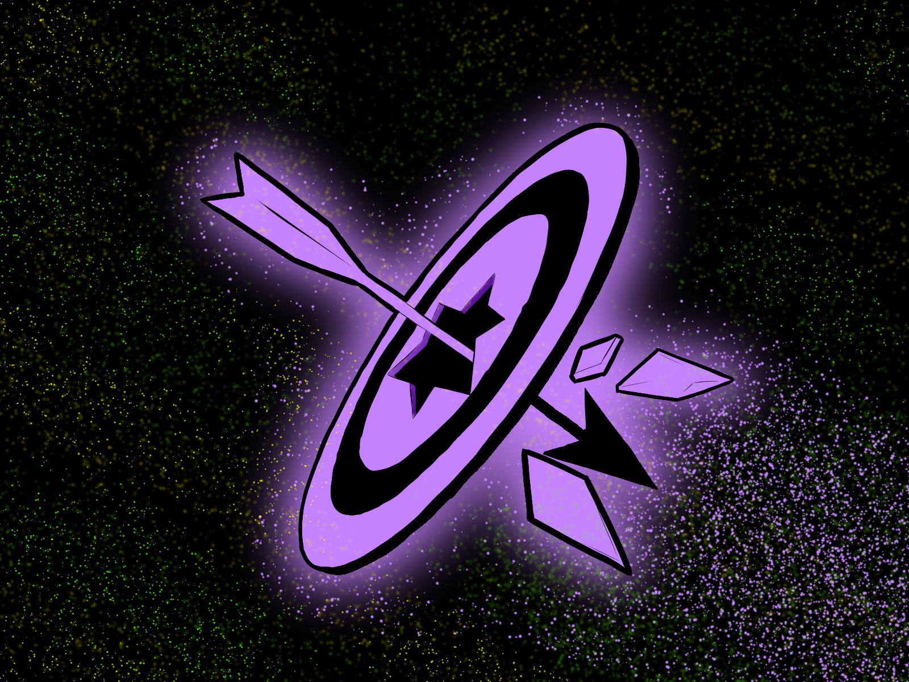
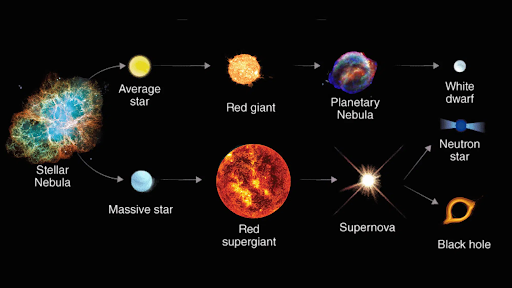
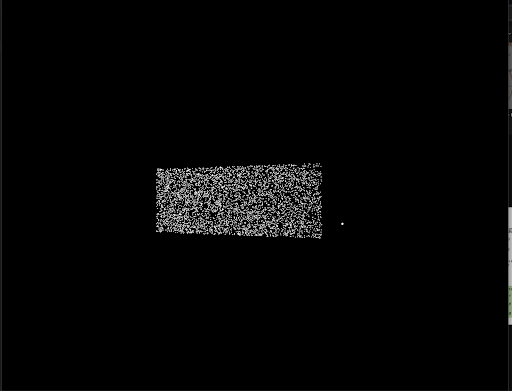

# HackCU 2026: Hyperion 

"Gravity Is The Harshest Critic"

# Hyperion Collapsar Star-Death Simulation

An interactive, particle-based physics simulation of a Collapsar (a massive star's dramatic transition into a black hole). This project visualizes the delicate balance between radiation pressure and gravity, the formation of accretion disks, and the release of relativistic jets.

## Overview
A Collapsar occurs when a massive star runs out of fuel. In this simulation, we model the moment gravity overcomes outward radiation pressure, causing the star to collapse into a black hole. 

Because the star is naturally spinning, the infalling material forms a hot, spinning accretion disk rather than falling straight in. This process triggers **Gamma-Ray Bursts (GRBs)** (powerful jets of energy) and a **hypernova** explosion.

## Table of Contents

## 👥 Meet the Team
* **Channa J**: Organization, Logo/Art, Documentation, and Research.
* **Dan O**: Camerawork and Development
* **Lila P**: Physics and Development
* **Sage E**: Graphics and Shaders Development

## 📷 Framework & Implementation

## 😭 Hoops & Hurdles

## 🤩 The Visual Process

**5,000 particles**

**{Video} Particles formed into a spherical object**

# hyperion
