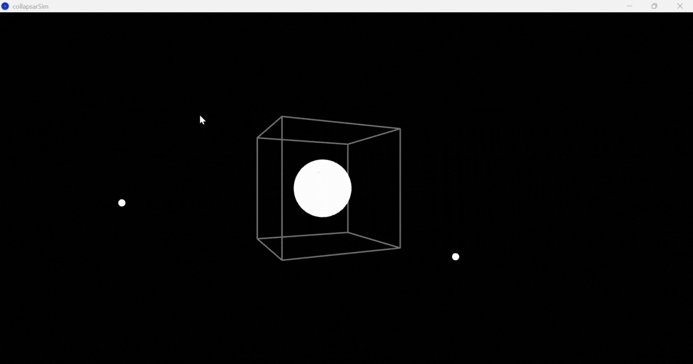
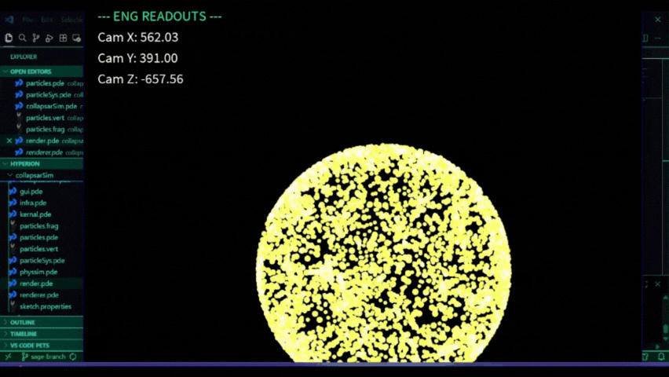
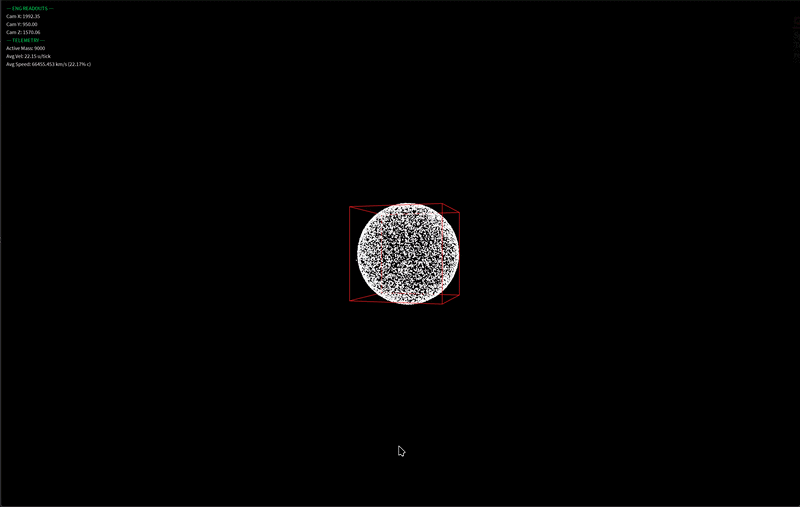
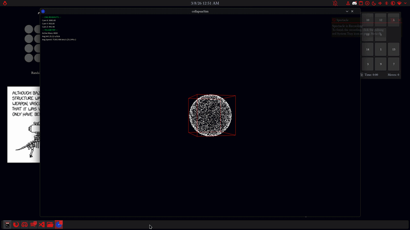
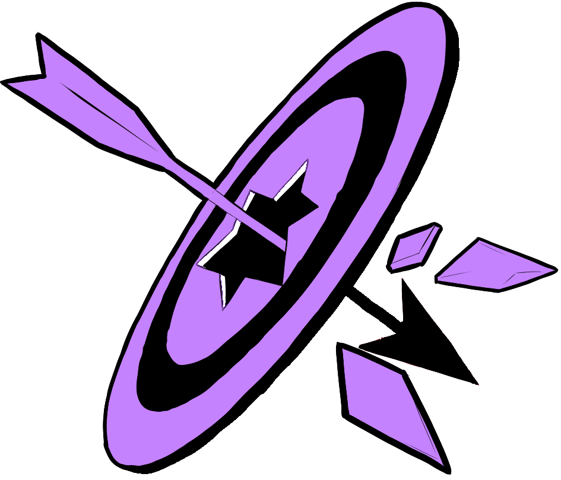

# HackCU 2026: Hyperion 

<p align="center">
<strong>*"Gravity Is The Harshest Critic"*</strong>
</p>


# 🌟Hyperion Collapsar Star-Death Simulation


An interactive, particle-based physics simulation of a Collapsar (a massive star's dramatic transition into a black hole). This project visualizes the delicate balance between radiation pressure and gravity, the formation of accretion disks, and the release of relativistic jets.

## Table of Contents

- [Overview](#overview)
- [👥 Meet the Team](#meet-the-team)
- [🎮 Running the Simulation](#running-the-simulation)
- [⚙️ Framework and Implementation](#framework-and-implementation)
- [🌌 The Visual Process](#the-visual-process)
- [📚 Links and References](#links-and-references)

<a id="overview"></a>
## Overview

A Collapsar occurs when a massive star runs out of fuel. In this simulation, we model the moment gravity overcomes outward radiation pressure, causing the star to collapse into a black hole. 

Because the star is naturally spinning, the infalling material forms a hot, spinning accretion disk rather than falling straight in. This process triggers **Gamma-Ray Bursts (GRBs)** (powerful jets of energy) and a **hypernova** explosion.


<p align="center">
  
</p>

<a id="meet-the-team"></a>
## 👥 Meet the Team

* [**Channa J**](https://github.com/FireEmblem3h): Organization, Logo/Art, Documentation, and Research.
* [**Dan O**](https://github.com/cult-of-maxwellism): Camerawork and Development
* [**Lila P**](https://github.com/TuckerPrebynski): Physics and Development
* [**Sage E**](https://github.com/b00kworm4lyf3): Graphics and Shaders Development

<a id="running-the-simulation"></a>
## 🎮 Running the Simulation

```
Space - Pause/unpause toggle
R - Rotates 360 (navigation limited to ⬆️ and ⬇️ arrows)
⬆️, ⬇️, ⬅️, and ➡️ Arrows - Manually rotates the camera (R toggle OFF)
```

<a id="framework-and-implementation"></a>
## ⚙️ Framework and Implementation

Lorem Ipsum is simply dummy text of the printing and typesetting industry. Lorem Ipsum has been the industry's standard dummy text ever since the 1500s, when an unknown printer took a galley of type and scrambled it to make a type specimen book. It has survived not only five centuries, but also the leap into electronic typesetting, remaining essentially unchanged. It was popularised in the 1960s with the release of Letraset sheets containing Lorem Ipsum passages, and more recently with desktop publishing software like Aldus PageMaker including versions of Lorem Ipsum.

<a id="the-visual-process"></a>
## 🌌 The Visual Process

<p align="center">
<strong>5,000 particles</strong>
</p>

<p align="center">
  
</p>

<p align="center">
<strong>Particles forming into a spherical object</strong>
</p>


<p align="center">
<strong>First peek of the camera work</strong>
</p>


<p align="center">
<strong>Shape structure</strong> 
</p>



<p align="center">
<strong>Implosion draft</strong>
</p>



<p align="center">
<strong>Implosion into Black hole draft</strong>
</p>



<p align="center">
<strong>Black hole draft</strong>
</p>




<a id="links-and-references"></a>
## 📚 Links


**Want a deeper dive into the project? Check out our Google Doc [here!](https://docs.google.com/document/d/1_Y3OA4gx3A6Lj1nX1JPAvsthqIQH9s7wRs-A8DgGQSU/edit?usp=sharing)**


## Thank you for your time, and thank you HackCU!


